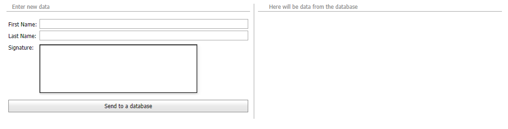

# How to imitate the Signature Control by using an XtraReport picture box

<p>XtraReport allows you to embed a picture element into your report. This demo illustrates this approach: <a href="https://demos.devexpress.com/MVCxReportDemos/Interaction/EFormReport">E-Form</a>. Here, XtraReport is created with the XRPictureBox element whose Enabled property is set to true. Setting this property to true allows you to draw in the picture box area. ASPxWebDocumentViewer is used to show XtraReport.</p>

<p>This is possible to customize ASPxWebDocumentViewer and XtraReport and show a picture box element as if it is a separate signature control. Steps below illustrate how to accomplish this task:</p> 

1. Create a new XtraReport.
2. Drop a picture box element onto your report.
3. Set the XtraReport.PaperKind property to Custom.
4. Customize the XtraReport PageWidth and PageHeight properties to show only the picture box.
5. Drop ASPxDocumentViewer onto your form and bind it to your XtraReport.
6. Handle its CustomizeElement and Init events to hide some elements of the viewer:

```aspx
<dx:ASPxWebDocumentViewer ID="ASPxWebDocumentViewer1" Width="360px" Height="120px" ClientInstanceName="viewer" runat="server" ColorScheme="dark" ReportSourceId="WebApplication1.XtraReport1">
    <ClientSideEvents CustomizeElements="customizeElements" />
    <ClientSideEvents Init="onInit" />
</dx:ASPxWebDocumentViewer>
```
```js
function onInit(s, e) {
    $('.dxrd-preview-wrapper').css('top', 10);
}

function customizeElements(s, e) {
    var toolbarPart = e.GetById(DevExpress.Reporting.Viewer.PreviewElements.Toolbar);
    var index = e.Elements.indexOf(toolbarPart);
    e.Elements.splice(index, 1);
    toolbarPart = e.GetById(DevExpress.Reporting.Viewer.PreviewElements.RightPanel);
    index = e.Elements.indexOf(toolbarPart);
    e.Elements.splice(index, 1);
}
```

7. To hide the viewer's black border and move the viewer a little, specify the following CSS style:

```css
.dx-designer-viewport .dxd-back-primary-invariant {
    background-color: #ffffff;
    margin: -6px -11px 0;
}
```

8. Implement a DocumentOperationService descendant and store your Signature to the database as a byte array:

```cs
public class CustomDocumentOperationService : DocumentOperationService {

    public override bool CanPerformOperation(DocumentOperationRequest request) {
        return true;
    }
    public override DocumentOperationResponse PerformOperation(DocumentOperationRequest request, PrintingSystemBase initialPrintingSystem, PrintingSystemBase printingSystemWithEditingFields) {
        ImageSource imageSource = printingSystemWithEditingFields.EditingFields[0].EditValue as ImageSource;
        if (imageSource != null) {
            var img = imageSource.Image;
            byte[] arr = ImageToByte(img);
            SaveToDataBase(arr);
        }
        return base.PerformOperation(request, initialPrintingSystem, printingSystemWithEditingFields);
    }   
    ....
}
```

9. To invoke the PerformOperation method, call the PerformCustomDocumentOperation method in the client "Save to a database" click event:

```js
function onClick(s, e) {
    var p = viewer.PerformCustomDocumentOperation();
    p.done(function (arg1) {
        btn.DoClick();
    });
}
```

10. In the promise of the PerformCustomDocumentOperation operation, send a postback to save other fields of the form to the database:

```cs
protected void ASPxButton2_Click(object sender, EventArgs e) {
    SaveToDataBase(FirstName.Text, LastName.Text);
    GetDataFormDatabase();//to illustrate the result
    ClearEditors();
}
...
```

The result is illustrated in the following gif:




<br/>
<!-- default file list -->
Files to look at:

* [CustomDocumentOperationService.cs](./CS/WebApplication1/WebApplication1/CustomDocumentOperationService.cs)
* [Default.aspx](./CS/WebApplication1/WebApplication1/Default.aspx)
* [Default.cs](./CS/WebApplication1/WebApplication1/Default.aspx.cs)
* [Global.cs](./CS/WebApplication1/WebApplication1/Global.asax.cs)
<!-- default file list end -->


